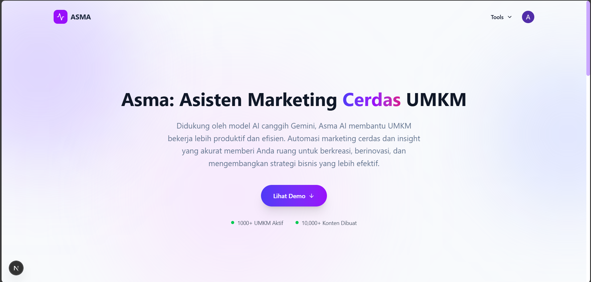

# ASMA AI: Asisten Marketing Cerdas UMKM 🚀


> Solusi cerdas berbasis web untuk membantu UMKM dalam manajemen pemasaran dan diagnosa kesehatan finansial.

---



---

## 🔗 Demo Langsung

> 🌐 **Live Demo:** [https://asma-ai.vercel.app](https://asma-ai.vercel.app)

---

## 📖 Tentang Proyek

**ASMA AI** adalah aplikasi web inovatif yang dirancang untuk menjawab tantangan utama yang dihadapi oleh Usaha Mikro, Kecil, dan Menengah (UMKM): **literasi keuangan** dan **pemasaran digital**.

---

## ✨ Fitur Unggulan

### 1. 🤖 Digital Content Generator (Image-to-Text)

- **Generate Caption:** Membuat _caption_ Sosial Media yang menarik secara instan.
- **Ide Konten:** Memberikan rekomendasi strategi konten yang disesuaikan dengan jenis usaha.

### 2. 📊 Diagnosa Kesehatan Finansial

- Input data keuangan sederhana.
- Mendapatkan skor kesehatan finansial dan rekomendasi perbaikan otomatis dari AI.

### 3. 🚀 Smart Proposal Generator

- **Instant Proposal:** Menyusun dokumen pengajuan dana atau investasi yang terstruktur dan profesional dalam hitungan menit.
- **Strategic Insight:** Memberikan analisis peluang dan rekomendasi keputusan bisnis untuk meyakinkan investor.

---

## 🛠️ Teknologi yang Digunakan

Proyek ini dibangun menggunakan _tech stack_ modern untuk menjamin performa dan skalabilitas:

- **Frontend:** [Next.js](https://nextjs.org/) (React Framework)
- **Styling:** [Tailwind CSS](https://tailwindcss.com/)
- **Model LLM:** [Google Gemini API](https://ai.google.dev/)
- **Database:** [Supabase](https://supabase.com/)
- **Deployment:** [Vercel](https://vercel.com/)

---

## 📁 Struktur Folder

```
asma-ai/
├── public/              # Aset statis (gambar, icon, dll)
├── src/
│   ├── app/             # App Router Next.js (pages & API routes)
│   ├── components/      # Komponen React reusable
│   ├── context/         # React Context untuk state management
│   ├── lib/             # Utility libraries & konfigurasi
│   ├── schema/          # Schema validasi
│   ├── services/        # Service layer untuk API calls
│   └── utils/           # Fungsi helper & utilities
├── .env.local           # Environment variables
├── next.config.mjs      # Konfigurasi Next.js
├── tailwind.config.js   # Konfigurasi Tailwind CSS
└── package.json         # Dependencies & scripts
```

---

## 🚀 Cara Instalasi & Menjalankan (Local)

Ikuti langkah-langkah berikut untuk menjalankan proyek ini di komputer Anda:

### Prasyarat

- Node.js (versi 18 atau terbaru)
- NPM atau Yarn
- API Key dari Google Gemini AI

### Langkah-langkah

1.  **Clone Repositori**

    ```bash
    git clone https://github.com/AlfinurFitraWijayaR/asma-ai.git
    cd asma-ai
    ```

2.  **Install Dependencies**

    ```bash
    npm install
    # atau
    yarn install
    ```

3.  **Konfigurasi Environment Variable**
    Buat file `.env.local` di direktori utama proyek, lalu tambahkan konfigurasi berikut:

    ```env
    NEXT_PUBLIC_GEMINI_API_KEY=masukkan_api_key_gemini_anda_disini
    # Tambahkan env variable lain jika ada (misal database URL)
    ```

4.  **Jalankan Server Development**

    ```bash
    npm run dev
    ```

5.  **Buka Aplikasi**
    Buka browser dan kunjungi `http://localhost:3000`.

---

## 👥 Tim Pengembang

Proyek ini dikembangkan sebagai bagian dari tugas akhir mata kuliah _capstone project_.

- **Alfinur Fitra Wijaya.R** - _Project Manager & Fullstack Developer_

- **Faizal Anugrah Pratama** - _Fullstack Developer_

- **Muqit Ridho** - _UI/UX Design_

---

## 📄 Lisensi

Proyek ini dilisensikan di bawah lisensi **MIT**. Lihat file [LICENSE](LICENSE) untuk informasi lebih lanjut.

---

## 📞 Kontak & Dukungan

Jika Anda memiliki pertanyaan atau masukan, silakan hubungi:

- 📧 **Email:** alfinurfitrawijaya13@gmail.com

---

## ⭐ Dukung Proyek Ini

Jika proyek ini bermanfaat bagi Anda, berikan ⭐ di GitHub!

---

<p align="center">
  Dibuat dengan ❤️ oleh Tim ASMA AI
</p>
